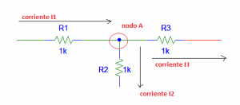
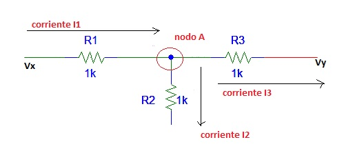
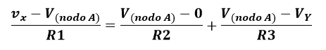

# PRÁCTICA No. 3  Análisis de Nodos 

#### Integrantes:

CALDERON VIDAL MATEO ESTEBAN

CAMACHO SIZA JOSUE EVERETT

GUEVARA CARVAJAL LUIS EDUARDO

#### NRC:

5406

### Objetivo

*Objetivo General*

- Comprender  el  método  de  análisis de Nodos, para determinar los voltajes presentes en un circuito eléctrico.

*Objetivos específicos*

- Realizar comparaciones entre los datos teóricos usando las técnicas de análisis de circuitos y los datos prácticos adquiridos en el desarrollo de la práctica.
- Comprobar la efectividad del uso del método de nodos para el análisis de circuitos.
- Entender las conexiones y forma de uso del protoboard, del multímetro y de los   demás materiales de laboratorio para hacer un uso correcto de ellos, ya que cada uno tiene una forma específica de uso.

### Marco Teórico

***¿Que es un nodo?***

Un nodo es un punto donde dos o más componentes tienen una conexión común. Corresponde a una unión de alambres hechos de material conductor que poseen una resistencia eléctrica cercana a 0.

***Analisis de nodos***

El análisis de nodos nos brinda un procedimiento general para resolver circuitos con el uso de voltajes de nodo como variables a encontrar. La elección de los voltajes de nodo en vez de voltajes de elementos o dispositivos, resulta conveniente y reduce la cantidad de ecuaciones simultáneas a resolver.El análisis de nodos nos ofrece tres criterios importantes que son los siguientes:
  - Nos proporciona modos diferentes de transformar diagramas de circuitos en matrices con un número mínimo de incógnitas.
  - Las ecuaciones matriciales se deben dar en forma estándar pero su solución debe ser en forma manual  o por computadora.
  - Cualquiera o todas las demás variables de interés, se deben obtener a partir de la solución de la ecuación matricial.
 
***Pasos para determinar los voltajes de un nodo***

1. Seleccione un nodo como nodo de referencia. Asigne los voltajes V1, V2, Vn-1 a los n-1 nodos restantes. Los voltajes se asignan de acuerdo al nodo de referencia. Nota: (-1) es el nodo de referencia
2. Aplique luego la ley de corriente de KIRCHHOFF para cada uno de los nodos (n-1) que son de no referencia. Una vez hecho esto, use la ley de ohm para expresar las corrientes de las ramas en términos de los voltajes de nodo.
3. Resuelve las ecuaciones simultáneas para obtener los voltajes de nodo desconocidos.

Siendo más claros sería de la siguiente manera:
La ley de corriente de Kirchhoff y una clave para aplicarlo a cada nodo es la siguiente: sume las corrientes que entran al nodo e iguale a las que salen, y hágalo de la siguiente forma:

  **Σ I (entran al nodo) = Σ I (salen del nodo)**

Gráficamente se representará de la siguiente forma cuando tengamos un nodo:

Se puede observar como al nodo A  entra la corriente I1, de igual forma podemos observar cómo del mismo nodo salen dos corrientes que son I2 e I3 por lo cual y basados en la ecuación expresada anteriormente podríamos reemplazar las corrientes expresadas en la ecuación 1 y nos quedaría de la siguiente forma:

   **I1= I2+ I3**
   
Gráficamente se representará de la siguiente forma:

     
Podemos observar que los puntos Vx y Vy poseen voltaje, la expresión de las corrientes en términos de voltaje sobre resistencia V/R  y en relación con la ecuación de las corrientes que entran igual a las que salen, la ecuación transformada nos quedaría de la siguiente forma:

     
De acuerdo a la ecuación anterior, Vx representa el voltaje de entrada. Vy es el voltaje de salida o voltaje en otro punto.

### Explicación del procedimiento

***Material y equipo requerido***

Tabla I. Materiales y Equipo

***Pasos a seguir***
1. Iniciar el simulador y seleccionar los materiales a utilizar.
2. Preparar los materiales en el simulador: resistencia con cada valor y las fuentes de energía.
3. Elaborar un circuito con las cinco resistencias con la forma indicada en la guía.
4. Medir cada uno de los voltajes de los nodos, voltaje y corriente de cada resistencia y anotar los resultados.
5. Analizar los nodos para obtener los resultados analiticos de cada voltaje y de cada corriente.

***Procedimiento***

Figura 1.- Circuito de analisis de nodos

Figura 2.- Circuito para el análisis de nodos

### Resultados

***Porcentaje de error relativo entre los valores teóricos y los experimentales***

***Análisis de los resultados***

Tabla 1.1 Resultados Obtenidos para el circuito de la figura 1

### Video

### Conclusiones

### Anexos

### Bibliografía
